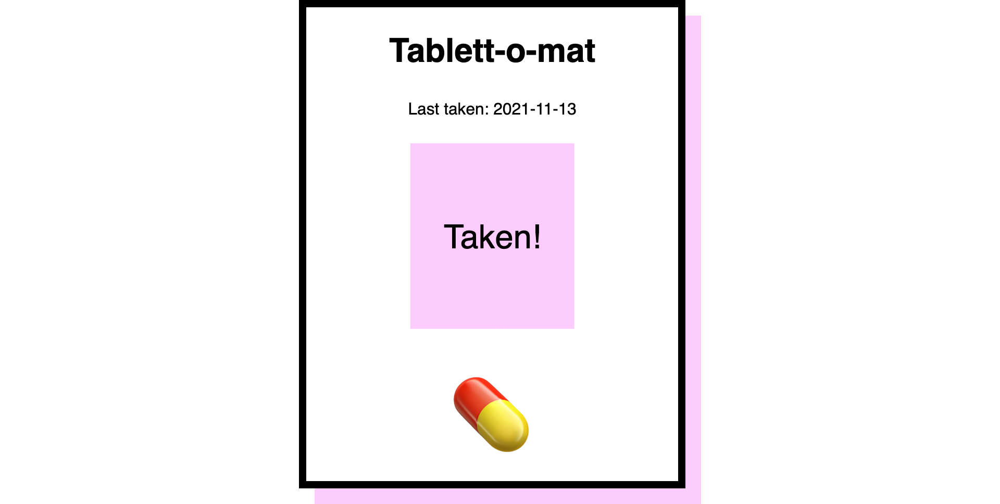

# 🧶 fingerstring, a serverless daily reminder
An extremely tiny daily reminder app that keeps nagging you until you actively confirm that you've done what you set out to do.

It can be hosted locally, even behind NAT, and will still be reachable from the internet.
Powered by [patchbay](https://patchbay.pub/) for serving pages and [Pushover](https://pushover.net/) for notifications.

Written in Bash. Named after the [String on Finger](https://tvtropes.org/pmwiki/pmwiki.php/Main/StringOnFingerReminder) trope.



## Motivation
Sometimes, regular reminders aren't enough: When a reminder arrives at the wrong time, it's easy to miss it. We could be distracted, or acknowledge the reminder with a "Yeah, I'll do it in a second".

I've built this little tool to help _aggressively_ push reminders for tasks that should absolutely not be forgotten.

## Implementation

The big constraint with fingerstring was that I wanted to be able to host it on a machine running in my own home, while still being able to send notifications and confirm tasks while out on the road. There's a few reasons for this:

- I already run a Raspberry Pi to serve a number of applications in my local home network.
- I don't want to deal with the configuration and administration overhead that would be involved with hosting it on any Enterprise-ready™ deployment solution. It's an app that sends a message every half-hour, that shouldn't require Kubernetes.
- I didn't want to pay for a virtual server or some dynamic website hoster just to run this one application.

However, I wanted to use an alternative approach that didn't rely on the typical tunneling mechanisms of [`ngrok`](https://ngrok.com/) or [Cloudflare Tunnel](https://developers.cloudflare.com/pages/how-to/preview-with-cloudflare-tunnel), or exposing my Pi to the internet directly.

### Serving page and handling interaction via patchbay
The _magic sauce_ that makes fingerstring work, regardless of where the machine is running, is [patchbay](https://patchbay.pub/).

When I first came across the tool, its philosophy immediately resonated with me:

> The entire philosophy of patchbay is that all the logic is done on your local machine(s), typically with small shell snippets. The server exists only for you to connect ("[patch](https://en.wikipedia.org/wiki/Patch_panel)") different components together.

A patchbay endpoint (which is created ad-hoc) implements a multi-producer, multi-consumer queue (MPMC), blocking consumers if there are no producers, and vice versa (more on that on the [excellent homepage](https://patchbay.pub/)).

The `serve.sh` and `update.sh` scripts both use patchbay:

- `serve.sh` keeps feeding the configured `pageChannel` with POST requests that contain the UI page (and also substitutes variables in the template). When you open the `pageChannel` in your browser, this script serves you an HTML page.
- `update.sh` blocks and waits for an incoming message on the `submitChannel` – usually triggered by hitting the button in the UI. When it receives a message, it replaces the date in `lasttaken.txt` with the current date.

### Sending notifications via Pushover
Running `notify.sh` script triggers a notification with the pre-configured text, and URL to the web interface. The notification is only sent if the current date is different from the date stored in `lasttaken.txt`.

The [Pushover API](https://pushover.net/api) accepts regular POST requests, and sends notifications to any mobile device that has the Pushover client installed.

### Managing configurations for bash scripts with `jq`
Apparently, providing config files for bash scripts is [a tougher problem than I would have anticipated](https://unix.stackexchange.com/questions/175648/use-config-file-for-my-shell-script). There does not seem to exist "one true way" of providing these configurations, so I have opted for using a `.json` configuration file, and using the [jq JSON processor](https://stedolan.github.io/jq/) for extracting different values from it. It allos me to query the confugration file by (nested) keys, and extract their raw values for use inside the script:
```bash
MESSAGE=$(<config.json jq --raw-output '.pushover.notificationMessage')
```

## Usage
If you'd like to play around with fingerstring, follow the instructions below. The setup is rather straightforward.

### Dependencies
This reminder tool requires `curl` and `jq` to be installed on the target system.

patchbay does not require any kind of user signup. If you want to use mobile notifications, a [Pushover](https://pushover.net/) account is required.

Create a file called `config.json`:
```json
{
    "pageChannel": "Generate a UUID and put it here",
    "submitChannel": "Generate a UUID and put it here",
    "pushover": {
        "token": "Your Pushover application API token",
        "user": "Your Pushover user key",
        "notificationMessage": "This is what the notification says!"
    }
}
```

Execute `run.sh` to make the reminder app available from the web.

Every time you run `notify.sh`, and the date in `lasttaken.txt` differs from the current date, you'll be sent a notification. Use a scheduler like `cron` to customize the schedule for notifications.

I personally run it on a [`2,32 9-18 * * *`](https://crontab.guru/#2,32_9-18_*_*_*) schedule (at minute 2 and 32 past every hour from 9 through 18).
